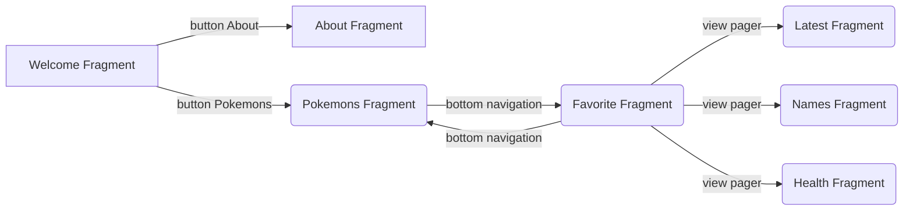

# This is Pokemonchiki (:

## Technologies used

-   shimmer layout
-   dagger 2
-   room
-   paging
-   glide
-   retrofit
-   coroutines
-   coordinator
-   view pager
-   navigation component

## Release APK
- https://github.com/gazievDima/apk-release.apk

## Navigation app

## Screens

