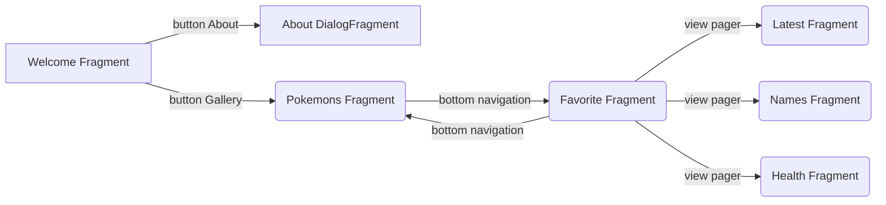

# This is Pokemonchiki (:

## Technologies used

-   api https://pokemontcg.io
-   retrofit
-   dagger 2
-   room
-   coroutines
-   navigation component
-   custom view (combine view group)
-   shimmer layout
-   paging
-   glide
-   coordinator
-   view pager

## Release APK
- https://github.com/gazievDima/PokemonsApi/blob/main/pokemonchiki.apk

## Navigation app

## Screens

